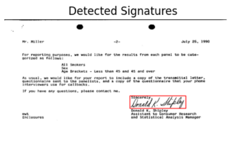

# Signature Detection using Faster R-CNN

A deep learning-based solution for detecting signatures in documents using Faster R-CNN with a VGG16 backbone. This project demonstrates how to train and evaluate an object detection model for signature localization.

## Key Features
- **Faster R-CNN Architecture**: Custom implementation with VGG16 backbone for feature extraction
- **Robust Data Handling**: Custom dataset loader with annotation processing
- **Training Pipeline**: Complete training loop with early stopping
- **Evaluation Metrics**: IoU-based accuracy calculation
- **Visualization**: Easy-to-use prediction visualization

## Dataset
The model is trained on a custom dataset containing:
- Document images with signatures
- Corresponding text files with bounding box coordinates in format: `x1,y1,x2,y2`


## Model Architecture
```python
VGG16 Backbone → Region Proposal Network → ROI Pooling → Bounding Box Regression & Classification
```

## Performance
| Metric          | Score  |
|-----------------|--------|
| Training Loss   | 0.0468 |
| IoU Accuracy    | 0.9739 |


## Results

